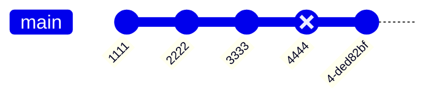

> https://git-scm.com/book/zh/v2
> https://www.yiibai.com/git/git-quick-start.html
> https://github.com/521xueweihan/git-tips
> https://www.ruanyifeng.com/blog/2016/01/commit_message_change_log.html

## config

```sh
# 查看当前的设置
git config -list

# 当前所在目录配置
git config --local --list

# 全局配置
git config --global --list

# 系统配置
git config --system --list

# 查看git命令
git config --help
git help config
```

### set config

```sh
git config --global user.name "littlefatcat"
git config --global user.eamil "littlefatcat@163.com"
git config --global color.ui true
```

### unset config

```sh
git config --global --unset user.email
```

## SSH

```sh
# generate the key in the usr/.ssh dir
ssh-kengen
```
- `id_rsa.pub` public key
- `id_rsa` private key

## workspace


- `workspace` 工作区，存放代码的地方
- `index/stage` 暂存区，临时存放的改动
- `repository` 本地仓库，安全存放数据的位置，其中`HEAD`指向当前的分支，默认分支`main`
- `remote` 远程仓库，托管代码的服务器


### three kinds of file's status

- `modified` 已修改
- `staged/indexed` 已暂存
- `committed` 已提交

## .gitignore

```.gitignore
# 忽略所有 .a结尾的文件
*.a
# 但 lib.a除外
!lib.a

# 忽略根目录下的 TODO 文件
/TODO

# 忽略build/目录下的所有文件
build/

# 忽略 doc/notes.txt 但不包括 doc/sub/notes.text
doc/*.txt

# 忽略doc/目录下的所有txt文件
doc/**/*.txt
```

## workspace command

### new repository

- `git init` dir init git repository
- `git clone <remote uri> [dir]` clone remote repository to dir, dir default is repository name 

### workspace add to stage


`git add` effect
1. 将未追踪的文件加入到追踪列表中，如新建了一个文件，git并没有追踪该文件，通过`git add`将文件添加到暂存区，使git能追踪该文件
2. 将已追踪的文件并且修改了的文件，纳入到**stage**
3. 文件出现冲突，解决冲突，通过`git add` 把这个文件标识为已解决冲突


- `git add .` add **workspace** all modified/deleted/created file to **stage**
- `git add <file>...` add working files to stage
- `git add [dir]` add working dir and all the files it contains to **stage**
- `git add *Controller` add all files ending in `Controller` to **stage**
- `git add Hello*` add all all files beginning in `Hello` to **stage**

### file status

- `git status` look at file status

### abandon workspace file changed

- `git checkout <file>...` abandon the files changed 
- `git checkout .` abandon all changed file

### stage restore to workspace

- `git restore <file>...` discard changes in working directory, like `git add`
- `git reset HEAD <file>...` as above

### stash temporary preservation

- `git stash [save "info"]` stack way, fitst in, last out
- `git stash -u` include untracked files
- `git stash list` query stash record list
- `git stash pop` apply recently stash and remove it from stash
- `git stash apply [stash@{0}]` apply the index stash, won't remove it from stash,
if I want to remove it, run `git stash drop [stash@{0}]`
- `git stash clear` clear all stash

## stage command

### stage commit to repository

- `git commit -m "commit info"` record changes to the repository
- `git commit --amend -m "commit info"` the last commit will merge with the previous commit and use new commit info

`--amend` the purpose is to modify the commit record, even if the stage not file changed

- `git commit -am "commit info"` === `git add` + `git commit -m "commit info"`

### commitizen
> https://www.ruanyifeng.com/blog/2016/01/commit_message_change_log.html

global install
```sh
npm install -g commitizen cz-conventional-changelog

echo '{ "path": "cz-conventional-changelog" }' > ~/.czrc
```
then use `git cz` replace `git commit`



### log

- `git log [-2]` necently 2 pieces of commited log
- `git log --pretty=oneline` oneline show one record
- `git log --graph` viewing logs graphically is offten used to view the bifurcation of a branch
- `git log origin/master` remote master branch log
- `git reflog` operate log -> `git log` is commit log

## repository command


### rollback commited

- `git reset --hard HEAD^` 往前一个commit，`^`的数量表示往前几个commit
- `git reset --hard HEAD~n` 往前n个commit
- `git reset --hard HEAD <commit>` reset HEAD commit, discard subsequent commits

eg: as shown above, there had four commit record, now reset
`git reset --hard HEAD 4444` -> 4444's commit record is abandoned, only records before the 4444's record




- `git revert HEAD~1` like git reset
- `git revert -n <commit>` revert the commit and generate a new commit, the previous record still exists

eg: as shown above, there had four commit record, now reset
1. `git revert -n 4444`
2. conflict resolution
3. `git revert --continue`
we can use `git reflog` find 4444 commit and use it yet


